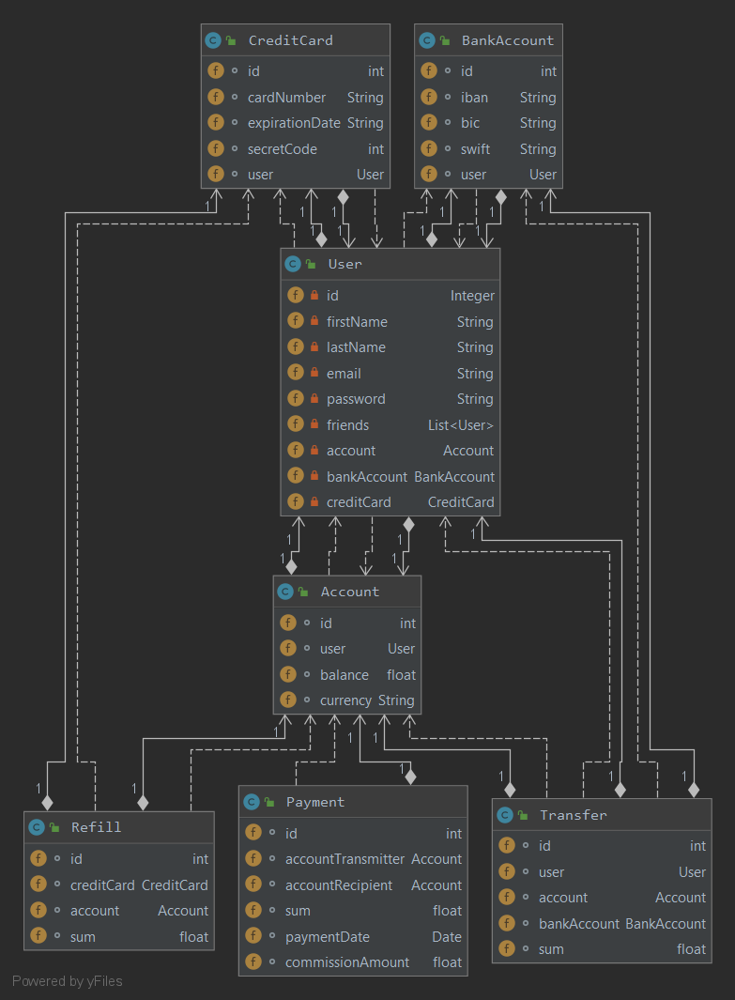

# Pay My Buddy

Pay My Buddy is a service that gives several features to a connected user : 
- Add friend
- Add a credit card 
- Add a bank account
- Send money to a friend (5% fees)
- Refill from credit card to user's account
- Transfer from user's account to his bank account

## Database Schema (UML)



## Prerequisite to run it

- Java 1.8 JDK (or +)
- Maven 3.5.X (or +)

- MySQL 5.X (or+) : You need to create a MySQL database named "pmb" on localhost:8080

## Run app

```mvn
mvn clean install
mvn clean verify (generate tests and test report)
mvn site (generate reportings)
```

```Spring Boot
mvn spring-boot:run (run app)
mvn spring-boot:stop (stop app)
```

## Authentication
In order to access endpoints or service url, you will be required to log in.
- Login = user 
- Password = password

(temporary values)

## Documentation
Read documentation and commands for used language if hosted elsewhere (than local) : 

[POSTMAN Documentation](https://web.postman.co/collections/10913454-a6589645-2d9c-4fd5-8129-f62ae0da9b6d?version=latest&workspace=d2092b1f-dd08-49c5-8834-19d41e8827bb)

## Contributing
Github repo is public, you can fork it and make improvements.
Please make sure to update tests as appropriate.

https://github.com/luckavn/sa.projet6/tree/develop
